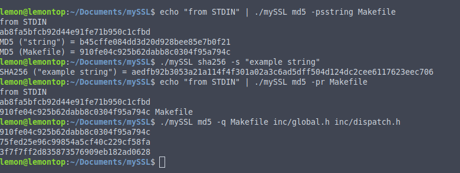

# mySSL
Purely an intellectual persuit in an attempt to understand how common crpytographic hashing functions work


### Installing

```
git clone https://github.com/AustinAWhite/mySSL.git
```
in root directory:
```
make
```
an executable 'mySSL' will be created

### Usage

```
./mySSL command [command opts] [command args]
```
##### Commands
* MD5
* SHA256

##### Command Ops
* p, echo STDIN to STDOUT and append the checksum to STDOUT
* q, quiet mode
* r, reverse the format of the output
* s, print the sum of the given string


